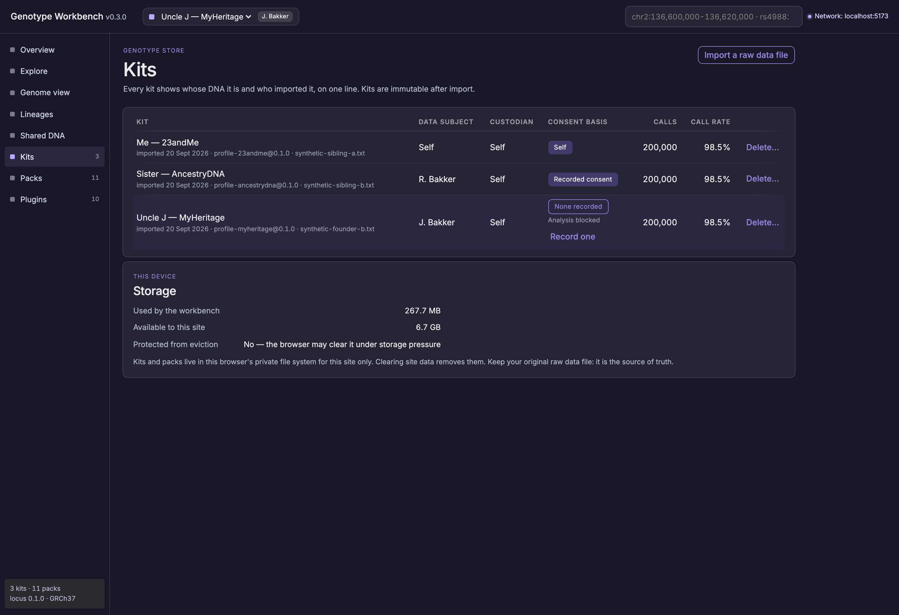
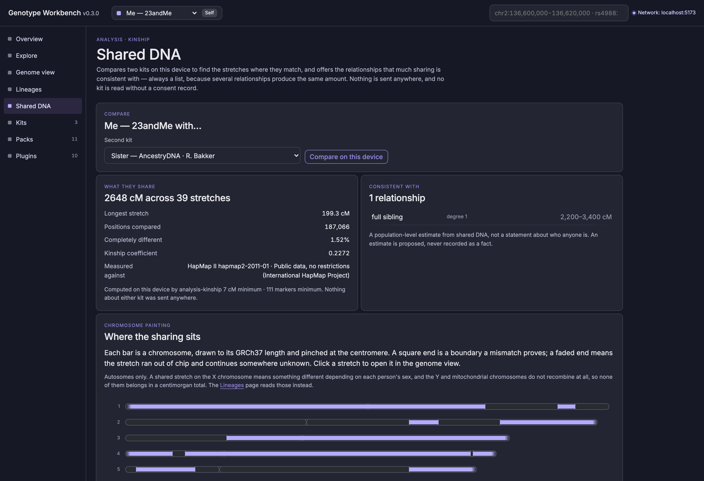
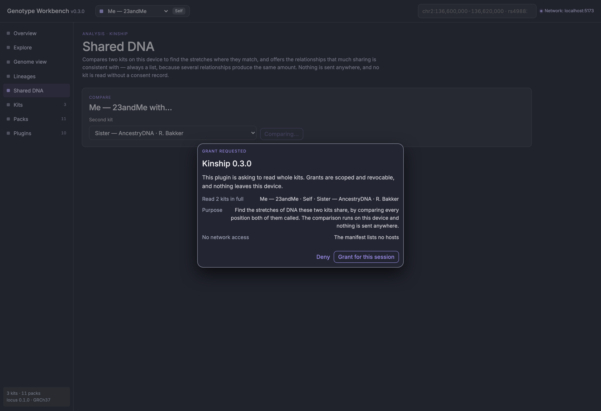
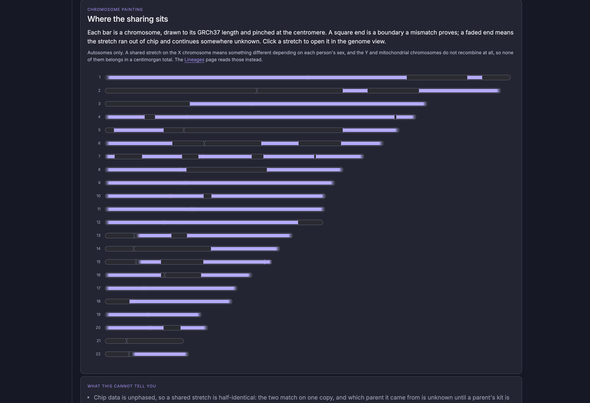

# Genotype Workbench

A local-first workbench for raw DNA files. Import an export from 23andMe, AncestryDNA, MyHeritage or FamilyTreeDNA, explore it on a genome view, join it to public databanks that arrive as whole downloaded packs, and compare two people to see what they share. Everything runs in your browser: no file is ever uploaded, and nothing reaches the network unless you grant it.


<sub>Every screenshot shows a synthetic kit (random genotypes on real chip positions), never a real person's DNA.</sub>

Design and decisions live in [`docs/`](docs/): [Core architecture](docs/Core%20architecture.md), [Decisions](docs/Decisions(1).md), [Scientific domains](docs/Scientific%20domains.md), the [ADRs](docs/adr/) and the Nocturne design system with the UI mockups.

## What it does

**Import.** A raw data file — 23andMe (chips v3–v5), AncestryDNA, MyHeritage or FamilyTreeDNA, all on build 37 — is read and normalized in a Web Worker by the Rust `locus` normalizer compiled to WASM, in about 1–2 s for a 640k-row file. Each vendor is a declarative format profile, not code (ADR-0006). Where a vendor does not write the genome build into the file, the profile says on whose word the positions are trusted, and the import report prints it. Every call is checked against the GRCh37 reference base. Strand-ambiguous (A/T, C/G) calls are flagged, no-calls are kept, and duplicate probes are merged. A custody record — whose DNA, who imported it, on what basis — is required before the kit is stored.


**Explore.** Starting points drawn from your own calls by joining them with the installed packs. Ordered by how well established the evidence is — review status, p-value, allele frequency — never by how important it might be for you. Includes a gene search that counts your calls per gene.


**Overview.** Call statistics, reference consistency, probe coverage per chromosome, the custody record, your calls per ClinVar classification, and a card pointing at where to look first.


**The genome view.** Tracks run the full width, each drawn in its evidence kind's form, so an association never looks like a classification. Pan, zoom, click to select, and search by region, rsID (including retired ones) or gene. Wide windows switch to binned density.

**The detail dock.** Selecting a position opens a panel beneath the tracks: your call and how it was checked, the classification with its conditions, each frequency pack, the protein, and the associations in a row below — side by side rather than stacked in a column.


**Sequence and protein.** Keep zooming and the tracks become the reference bases, your own called bases as letters, and the codons of the gene in view.


**3D structure.** A coding position names its residue and what the allele changes it to, computed here from GENCODE coding blocks and the GRCh37 sequence. Mol\* then shows the residue in the protein's predicted shape, after you grant the one request it takes.


**Lineages.** Maternal-line (mtDNA, PhyloTree 17) and paternal-line (Y, YFull YTree) haplogroups, matched on this device, shown with the markers that support them and what the chip could not read.


**Whose DNA, and who may read it.** Every kit records its data subject and its custodian on the same line, because the two differ as soon as a relative's kit arrives, and the consent basis it may be analysed under. A kit with no consent record is readable and viewable, but no analysis may touch it — and there is a route to recording one, which appends rather than overwrites, so the record still says what was true before.



**Shared DNA.** Two kits compared on this device: the stretches where they match, and the relationships that much sharing is consistent with — always a list, because several relationships produce the same amount of DNA. A parent is told from a sibling not by how much they share, which cannot distinguish them, but by the rate at which they disagree completely: a child inherits one full copy from each parent, so a parent and child never disagree anywhere.



Before either kit is read, the grant names them. Not "your data" — the actual kits and the actual people, so that someone consenting on a relative's behalf could read the sentence aloud to them. Kit grants last for the session only.



**Chromosome painting.** Where the sharing sits, across every chromosome that was compared. A square end is a boundary a mismatch proves; a faded end means the stretch ran out of chip and continues somewhere unknown. Only the chromosomes the analysis actually examined are drawn: an empty one beside full ones would read as a finding that was never made.



**Packs.** Public databanks arrive as whole packs from a signed index, each with its licence, size, row count and source. One button installs everything on offer; the app checks the site's storage quota first.


| Pack | Role | Evidence kind | Licence |
| --- | --- | --- | --- |
| GRCh37 reference at chip loci (core) | reference | documentary | Public domain |
| GENCODE 50 genes, lifted to GRCh37 | genes | documentary | Open access |
| GRCh37 sequence at coding exons and chip loci | sequence | documentary | Public domain |
| UniProt reviewed human proteome | proteins | documentary | CC BY 4.0 |
| ClinVar | classification | curated classification | CC0 |
| GWAS Catalog (lifted to GRCh37) | association | statistical association | CC0 |
| 1000 Genomes phase 3 frequencies | frequency | population frequency | Open |
| gnomAD v2.1.1 frequencies (on demand) | frequency | population frequency | CC0 |
| Mondo condition names | conditions | documentary | CC BY 4.0 |
| dbSNP rsID merges | rsid-merges | documentary | Public domain |
| HapMap II genetic map | genetic-map | estimate | Public |
| PhyloTree 17 mtDNA tree | haplotree-mt | documentary | MIT packaging |
| YFull YTree + YBrowse positions | haplotree-y | documentary | CC BY 4.0 + unverified |

They are built by `tools/packkit` (Python + DuckDB, normalized through the same Rust code via `locus-py`). The app downloads each pack whole, checks its SHA-256 against the signed index, and joins it locally: no variant is ever looked up remotely.

**Every network request is asked for.** A pack download or a structure request names the host, the size, what is sent (nothing about you) and which kits are read (none).


**What ClinVar says about your calls.** Positions where your call carries an allele a ClinVar record classifies, strongest evidence first: review status, then the strongest association at the same position.


Information, not diagnosis: the app shows what sources say, with citations. It computes no risk score.

## Quick start

Requirements: Node 22+, pnpm 11, Rust (stable) with the `wasm32-unknown-unknown` target, `wasm-pack`, and `uv`. The gnomAD pack also needs `bcftools`.

```sh
pnpm install
pnpm packs:chip-loci        # positions probed by 23andMe chips (from CC0 Harvard PGP files; positions only)
pnpm packs:build --skip gnomad-chip   # reference, genes, ClinVar, GWAS Catalog into packs-dist/
pnpm dev                    # builds the WASM + DuckDB extensions, serves the app with packs at /packs/
```

Open the printed URL, import your raw data file, then install packs from **Packs**.

The gnomAD pack streams about 460 GB of gnomAD v2.1.1 VCFs and keeps only chip loci. It writes only the filtered result (tens of MB), not the source, so the 460 GB is download traffic, not disk space. It takes hours; run it on purpose with `pnpm packs:build --only gnomad-chip`. The build resumes per chromosome, and `GW_GNOMAD_JOBS` sets the number of parallel streams. 1000 Genomes (a 1.5 GB stream) is the default frequency pack.

## Commands

| Command | What it does |
| --- | --- |
| `pnpm dev` / `pnpm build` / `pnpm preview` | App (Vite, Svelte 5, PWA) |
| `pnpm test` | Rust tests (incl. golden file) and Vitest |
| `pnpm test:e2e` | Playwright: import → overview → genome → pack install → reload, asserting no off-origin requests |
| `pnpm check` | `svelte-check` type checking |
| `pnpm packs:build [--only id…] [--skip id…]` | Build packs into `packs-dist/` and sign the index |
| `uv run --project tools/packkit packkit fixtures` | Cut small signed fixture packs for tests |
| `pnpm fixtures:kits -- --rows 5000 --out …` | A synthetic kit in any vendor's format (random genotypes on real chip loci) |
| `pnpm fixtures:kits -- --pedigree siblings --out-dir …` | A related pair, inherited through simulated meiosis over the genetic map |
| `pnpm check:no-genomes` | Fail if a real raw-data export is tracked |

## Layout

```
apps/web/                 Svelte 5 PWA shell; CSP connect-src 'self'
crates/locus/             Locus language: key, alleles, normalize(), reference check (ADR-0008)
crates/genotype-import/   declarative format-profile engine
crates/locus-wasm/        WASM bindings for the import worker
crates/locus-py/          Python bindings for pack builds
packages/plugin-sdk/      public plugin types (host API ^0.1)
packages/storage/         DuckDB-WASM over Parquet in OPFS
packages/genotype-store/  Kit, Call, Custody; import and read API
packages/annotation-library/  signed index, pack install, local joins, annotation tracks
packages/plugin-host/     manifests, grants, guarded fetch
packages/protein/         genome position to codon and residue; the genetic code
plugins/                  profile-* (23andMe, AncestryDNA, MyHeritage, FamilyTreeDNA),
                          view-tracks, view-structure (Mol*), view-painting,
                          analysis-haplogroups, analysis-kinship, pack-* build scripts
tools/packkit/            pack pipeline (uv)
fixtures/                 synthetic kits and fixture packs; never real data
```

## One tab at a time

Kits and packs are files on the device, and the query engine opens them exclusively, so the app runs in one tab per browser profile. A second tab says so and offers to retry; it recovers as soon as the first tab closes.

## Privacy guard rails

- Real raw-data exports are never committed: `.gitignore` covers them, and CI runs `scripts/check-no-genomes.sh`.
- A Content Security Policy limits the app to its own origin, plus one host: `alphafold.ebi.ac.uk`, for protein structures. The policy is the outer bound; a Plugin Host grant is still required before anything is fetched (ADR-0013). DuckDB extensions are vendored (`scripts/vendor-duckdb-extensions.mjs`, hash-pinned), and fonts are bundled.
- Packs are whole files. No variant is ever looked up remotely.
- No analysis reads a kit whose custody record has no consent basis. The Plugin Host refuses it before a dialog is ever shown, so a grant cannot be clicked past (ADR-0009, ADR-0015).
- Install scripts that report home are refused: Mol* pulls in `@scarf/scarf`, denied in `pnpm-workspace.yaml`.

## Deviations from the docs, by design

- **Genome view.** A custom canvas track view replaces igv.js for now, because igv.js cannot draw the evidence-kind encodings (ADR-0004 note).
- **Plugin sandboxing.** Sandboxed iframes are deferred until third-party plugins exist. First-party logic runs in workers (ADR-0006 note).
- **Metadata storage.** Kit, pack and grant metadata are small JSON files in OPFS. Calls and packs are Parquet.
- **Chromosome painting.** Drawn by an in-house canvas view rather than Gosling.js (ADR-0016). A segment's two ends mean different things — one is a boundary a mismatch proves, the other a run that left the chip — and no general genomics grammar expresses an end whose position is unknown. Adopting one would have meant bending the design system on the exact point it exists to make, and bringing React and HiGlass along with it.
- **Kinship compute.** A DuckDB join and a TypeScript walk, not Rust in a Worker (ADR-0016). Both kits are already database views, so the expensive half is a query; the walk over the result is linear. `crates/locus` still normalizes every call.
- **Six evidence kinds.** `population-frequency` was added (ADR-0011): a frequency is a fact about a sampled population, not an estimate about you, so it no longer shares the estimate's form.

## Licence

Not chosen yet (open question in the docs: MIT/Apache vs AGPL). Pack data carries its own licences, shown next to each pack.
