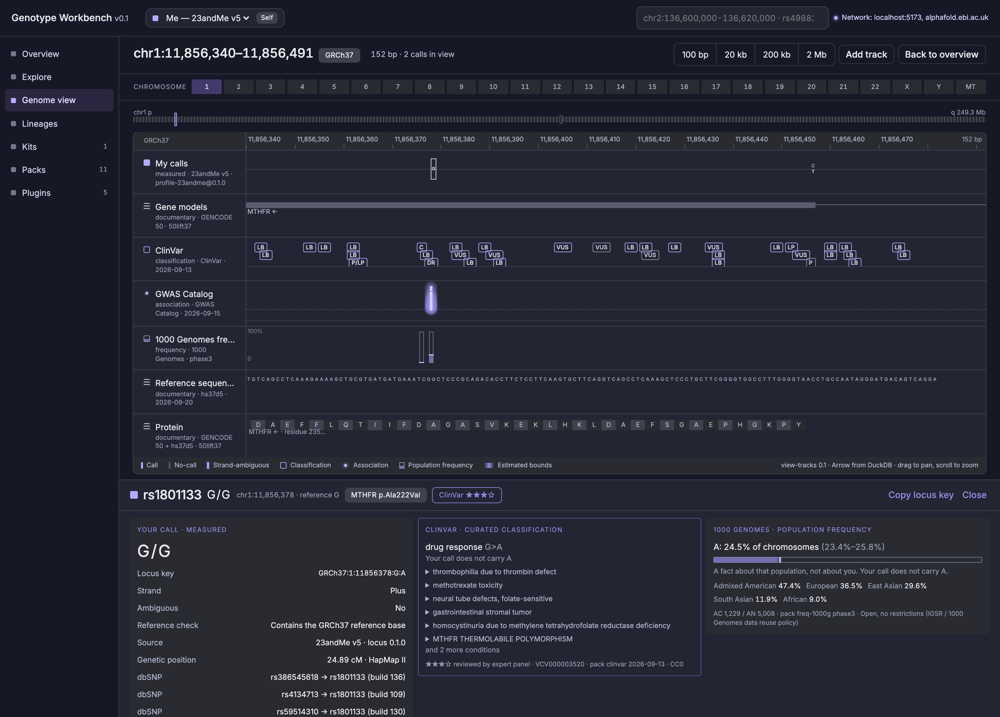
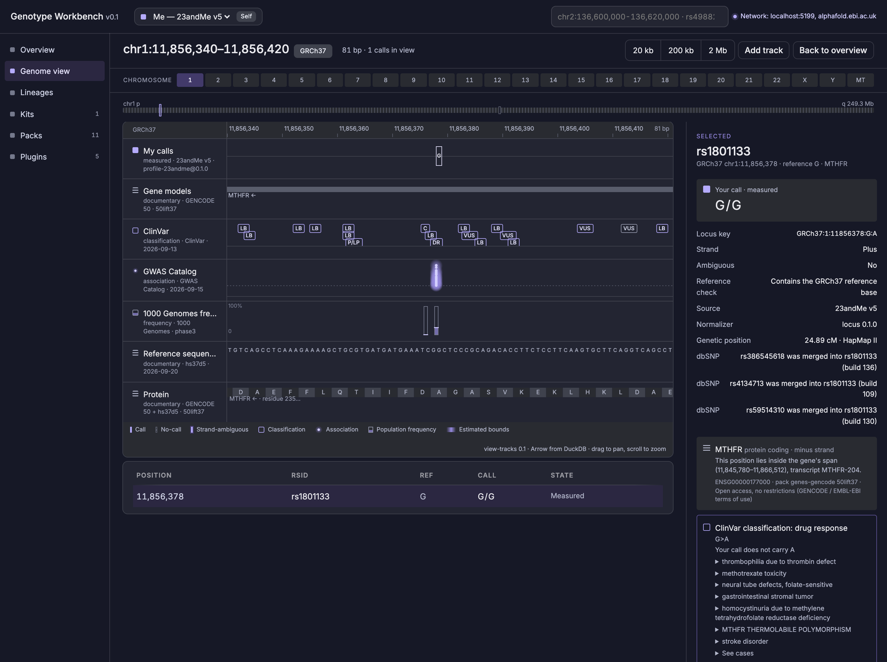
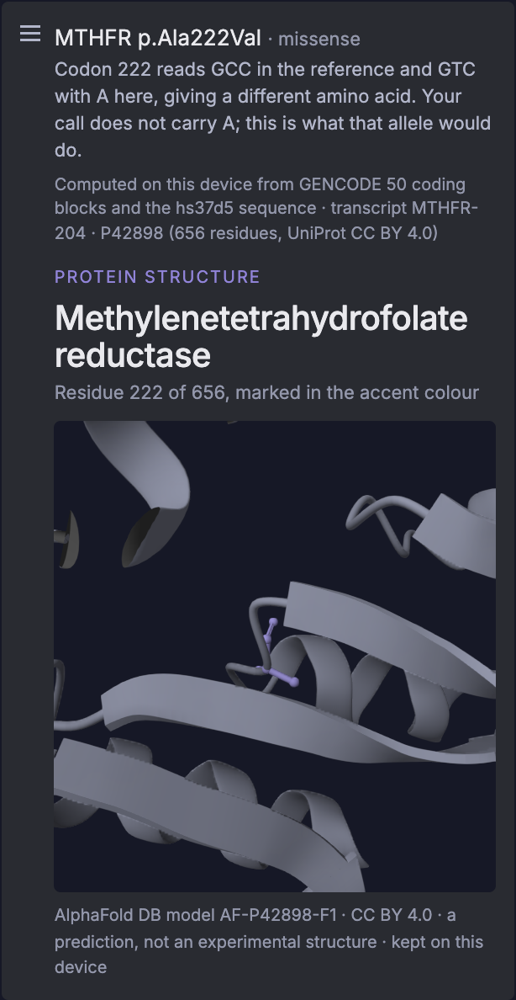

# Genotype Workbench

A local-first workbench for your own raw DNA file. Import a 23andMe export, explore it on a genome view, and join it to public databanks that arrive as whole downloaded packs. Everything runs in your browser: the file is never uploaded, and nothing reaches the network unless you grant it.



| Explore: where to start | Overview |
| --- | --- |
|  |  |

One zoom runs from the chromosome to the bases and the codons; a coding position names its residue and shows it in the protein.

| Sequence and protein in the same view | Residue in 3D |
| --- | --- |
|  |  |

<sub>Screenshots show a synthetic kit (random genotypes on real chip positions), never a real person's DNA.</sub>

Design and decisions live in [`docs/`](docs/): [Core architecture](docs/Core%20architecture.md), [Decisions](docs/Decisions(1).md), [Scientific domains](docs/Scientific%20domains.md), the [ADRs](docs/adr/) and the Nocturne design system with the UI mockups.

## Iteration 1: what works

- **Import.** A 23andMe raw data file (chips v3–v5, build 37) is read and normalized in a Web Worker by the Rust `locus` normalizer compiled to WASM, in about 1–2 s for a 640k-row v5 file. Every call is checked against the GRCh37 reference base. Strand-ambiguous (A/T, C/G) calls are flagged, no-calls are kept, and duplicate probes are merged. A custody record (data subject, custodian, consent basis) is required before the kit is stored.
- **Storage.** Each kit is a Parquet file in the browser's Origin Private File System, queried with DuckDB-WASM. Kits and packs survive reloads.
- **Overview.** Call statistics, reference consistency, probe coverage per chromosome, custody, your calls per ClinVar classification, and a card pointing at where to look first.
- **Explore.** Starting points drawn from your own calls: best-reviewed ClinVar records, strongest associations you carry an allele for, rarest alleles, coding changes translated on the device, and a gene search. Ordered by how well established the evidence is, never by how important it might be for you.
- **Genome view.** Tracks run the full width, and selecting a position opens a dock underneath with the call, the classification, frequencies, the protein and its 3D structure side by side. A canvas track view (`plugins/view-tracks`) draws each track in its evidence kind's form: measured calls, documentary gene models, curated ClinVar classifications, GWAS associations, and population frequencies. You can pan, zoom, click to select, and search by region, rsID (including retired rsIDs) or gene. Wide windows switch to binned density. The selected-position panel lists every source strongest evidence first, with ClinVar conditions explained through Mondo.
- **Sequence and protein.** Keep zooming and the tracks become the reference bases, your own called bases, and the codons of the gene in view. Select a coding position and the panel names the residue and what the allele changes it to (for example MTHFR p.Ala222Val), computed on this device from GENCODE coding blocks and the GRCh37 sequence.
- **3D structure.** Mol* shows the protein's predicted shape from AlphaFold with that residue marked. The structure is fetched once per protein, only after you grant it, and then kept on this device.
- **Lineages.** Maternal-line (mtDNA, PhyloTree 17) and paternal-line (Y, YFull YTree) haplogroups, matched on this device and shown with the markers that support them.
- **Packs.** Packs are built by `tools/packkit` (Python + DuckDB, normalized through the same Rust code via `locus-py`) and listed in an Ed25519-signed index. The app downloads each pack whole after a network grant, checks its SHA-256, and joins it locally. Before downloading, it checks that the site's storage quota can hold the pack.

| Pack | Role | Evidence kind | Licence |
| --- | --- | --- | --- |
| GRCh37 reference at chip loci (core) | reference | documentary | Public domain |
| GENCODE 50 genes, lifted to GRCh37 | genes | documentary | Open access |
| ClinVar | classification | curated classification | CC0 |
| GWAS Catalog (lifted to GRCh37) | association | statistical association | CC0 |
| 1000 Genomes phase 3 frequencies | frequency | population frequency | Open |
| gnomAD v2.1.1 frequencies (on demand) | frequency | population frequency | CC0 |
| Mondo condition names | conditions | documentary | CC BY 4.0 |
| dbSNP rsID merges | rsid-merges | documentary | Public domain |
| HapMap II genetic map | genetic-map | estimate | Public |
| GRCh37 sequence at coding exons and chip loci | sequence | documentary | Public domain |
| UniProt reviewed human proteome | proteins | documentary | CC BY 4.0 |
| PhyloTree 17 mtDNA tree | haplotree-mt | documentary | MIT packaging |
| YFull YTree + YBrowse positions | haplotree-y | documentary | CC BY 4.0 + unverified |

Information, not diagnosis: the app shows what sources say, with citations. It computes no risk score.

## Quick start

Requirements: Node 22+, pnpm 11, Rust (stable) with the `wasm32-unknown-unknown` target, `wasm-pack`, and `uv`. The gnomAD pack also needs `bcftools`.

```sh
pnpm install
pnpm packs:chip-loci        # positions probed by 23andMe chips (from CC0 Harvard PGP files; positions only)
pnpm packs:build --skip gnomad-chip   # reference, genes, ClinVar, GWAS Catalog into packs-dist/
pnpm dev                    # builds the WASM + DuckDB extensions, serves the app with packs at /packs/
```

Open the printed URL, import your raw data file, then install packs from **Packs**.

The gnomAD pack streams about 460 GB of gnomAD v2.1.1 VCFs and keeps only chip loci. It writes only the filtered result (tens of MB), not the source, so the 460 GB is download traffic, not disk space. It takes hours; run it on purpose with `pnpm packs:build --only gnomad-chip`. The build resumes per chromosome, and `GW_GNOMAD_JOBS` sets the number of parallel streams. 1000 Genomes (a 1.5 GB stream) is the default frequency pack.

## Commands

| Command | What it does |
| --- | --- |
| `pnpm dev` / `pnpm build` / `pnpm preview` | App (Vite, Svelte 5, PWA) |
| `pnpm test` | Rust tests (incl. golden file) and Vitest |
| `pnpm test:e2e` | Playwright: import → overview → genome → pack install → reload, asserting no off-origin requests |
| `pnpm check` | `svelte-check` type checking |
| `pnpm packs:build [--only id…] [--skip id…]` | Build packs into `packs-dist/` and sign the index |
| `uv run --project tools/packkit packkit fixtures` | Cut small signed fixture packs for tests |
| `pnpm fixtures:kits -- --rows 5000 --out …` | Synthetic 23andMe-format kits (random genotypes on real chip loci) |
| `pnpm check:no-genomes` | Fail if a real raw-data export is tracked |

## Layout

```
apps/web/                 Svelte 5 PWA shell; CSP connect-src 'self'
crates/locus/             Locus language: key, alleles, normalize(), reference check (ADR-0008)
crates/genotype-import/   declarative format-profile engine
crates/locus-wasm/        WASM bindings for the import worker
crates/locus-py/          Python bindings for pack builds
packages/plugin-sdk/      public plugin types (host API ^0.1)
packages/storage/         DuckDB-WASM over Parquet in OPFS
packages/genotype-store/  Kit, Call, Custody; import and read API
packages/annotation-library/  signed index, pack install, local joins, annotation tracks
packages/plugin-host/     manifests, grants, guarded fetch
packages/protein/         genome position to codon and residue; the genetic code
plugins/                  profile-23andme, view-tracks, view-structure (Mol*),
                          analysis-haplogroups, pack-* build scripts
tools/packkit/            pack pipeline (uv)
fixtures/                 synthetic kits and fixture packs; never real data
```

## One tab at a time

Kits and packs are files on the device, and the query engine opens them exclusively, so the app runs in one tab per browser profile. A second tab says so and offers to retry; it recovers as soon as the first tab closes.

## Privacy guard rails

- Real raw-data exports are never committed: `.gitignore` covers them, and CI runs `scripts/check-no-genomes.sh`.
- A Content Security Policy limits the app to its own origin, plus one host: `alphafold.ebi.ac.uk`, for protein structures. The policy is the outer bound; a Plugin Host grant is still required before anything is fetched (ADR-0013). DuckDB extensions are vendored (`scripts/vendor-duckdb-extensions.mjs`, hash-pinned), and fonts are bundled.
- Packs are whole files. No variant is ever looked up remotely.
- Install scripts that report home are refused: Mol* pulls in `@scarf/scarf`, denied in `pnpm-workspace.yaml`.

## Deviations from the docs, by design

- **Genome view.** A custom canvas track view replaces igv.js for now, because igv.js cannot draw the evidence-kind encodings (ADR-0004 note).
- **Plugin sandboxing.** Sandboxed iframes are deferred until third-party plugins exist. First-party logic runs in workers (ADR-0006 note).
- **Metadata storage.** Kit, pack and grant metadata are small JSON files in OPFS. Calls and packs are Parquet.
- **Six evidence kinds.** `population-frequency` was added (ADR-0011): a frequency is a fact about a sampled population, not an estimate about you, so it no longer shares the estimate's form.

## Licence

Not chosen yet (open question in the docs: MIT/Apache vs AGPL). Pack data carries its own licences, shown next to each pack.
