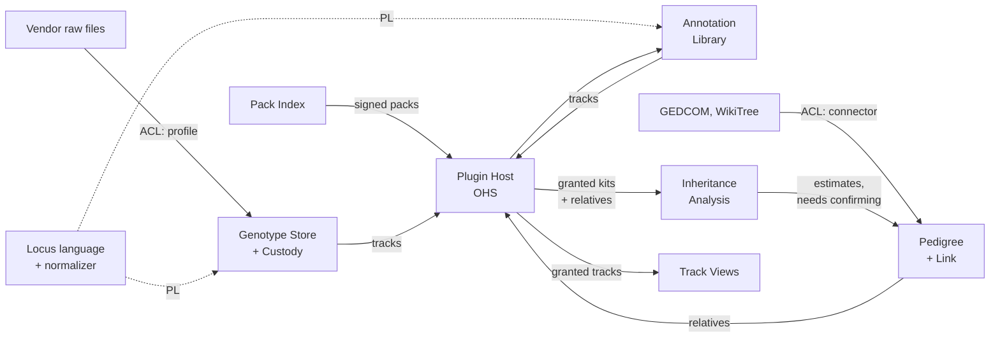

# Genotype Workbench — Core Architecture

2026-09-19 · @Someone

## Vision and principles

Genotype Workbench is a local-first tool where a person brings their own raw DNA file, explores it on a genome browser, enriches it through plugins, and links it to relatives and a pedigree. The core is a normalized genotype store behind a published coordinate language; everything else is a plugin that reads through the host or writes tracks next to it. This tab reflects the decisions in the Decisions tab and the gaps found in the Scientific domains tab.

**In scope for the core:** the Locus language and its reference normalizer, import and normalization of consumer genotype files, custody and consent per kit, the track model, the plugin host with scoped grants, a base genome view.

**Out of the core (plugins):** every annotation pack, every analysis (kinship, Mendelian checks, phasing, haplogroups), every view beyond the base genome view, GEDCOM and online genealogy connectors.

**Principles**

1. **Data never leaves the device by default.** Privacy is structural, not a policy promise. Network access is an explicit, per-plugin user grant.
2. **Everything is a track.** Genotypes, annotations and analysis results are genome-positioned tracks. Views only consume tracks.
3. **Annotations are joined, never baked in.** Personal data and reference knowledge live in separate stores and meet at query time.
4. **Reproducible by version.** Every result names the reference build, pack versions and importer version that produced it.
5. **Information, not diagnosis.** The app shows what sources say about a variant, with citations. It never computes a personal risk score or clinical interpretation.
6. **Standards over invention.** GRCh37/38 coordinates, VCF semantics, GEDCOM 7, rsIDs, VRS for export.
7. **Evidence kind is always visible.** A measurement, an association, a curated classification, an estimate and a documented fact are never shown the same way.
8. **Plugins may translate; only the core normalizes.** Correctness lives in one place; reach lives at the edges.

## Context map

Seven contexts plus one published language. Compared with the first draft, three things changed:

- **Inheritance Analysis** replaces Kinship. It is the missing context for transmission genetics: kinship segments, Mendelian consistency checks and phasing all live there, as analysis plugins.
- **Custody** and **Link** become explicit aggregates, inside Genotype Store and Pedigree respectively.
- **Pack Index** is new: it distributes signed packs and plugins.

| Context | Type | Owns | Scientific domains (see Scientific domains tab) |
| --- | --- | --- | --- |
| Locus language | Published language + reference normalizer | Locus key, allele rules, strand, build, glossary | Molecular genetics |
| Genotype Store | Core | Kit, Call, Custody (subject, custodian, consent) | Genotyping and bioinformatics |
| Annotation Library | Supporting | Pack, Source, Annotation, Citation, evidence kind | Population, statistical and clinical genetics; pharmacogenomics |
| Pedigree | Supporting | Person, Family, Relationship with provenance, Link (Person ↔ Kit) | Documentary genealogy |
| Inheritance Analysis | Supporting, plugin-based | Shared segment, relationship estimate, Mendelian error, phase | Transmission genetics, genetic genealogy |
| Track Views | Generic | Track rendering, evidence-kind encoding | All, as presentation |
| Plugin Host | Generic | Manifest, capability, grant | None |
| Pack Index | Generic | Signed index of packs and plugins | None |



Solid arrows are data flow, upstream to downstream; dotted arrows are the published language every context conforms to.

| Relationship | Pattern | Contract |
| --- | --- | --- |
| Vendor files → Genotype Store | Anticorruption layer | Declarative format profile, or code importer emitting `RawCall`; the core normalizes |
| Locus language → Genotype Store, Annotation Library, pack pipeline | Published language + one reference implementation | Locus key `build:chrom:pos:ref:alt`, VCF semantics, plus strand, `normalize()` in Rust (WASM, native, Python) |
| Pack Index → Plugin Host | Published language | Signed JSON index; pack manifest with domain, evidence kind, licence, SHA-256 |
| Genotype Store, Annotation Library, Pedigree → plugins | Open host service | Typed Track/Region API with grants scoped by kit, region and track kind; Arrow results |
| Plugin Host → Inheritance Analysis | Customer/supplier | Multi-kit reads only under Custody consent; Pedigree supplies who is related to whom |
| Inheritance Analysis → Pedigree | Customer/supplier, with a human gate | Estimates are proposed, never written as facts; the user confirms and the evidence is recorded |
| GEDCOM, WikiTree → Pedigree | Anticorruption layer | Connector maps to Person, Family, Relationship; unknown tags round-trip |
| Plugin Host → Track Views | Conformist | Views render any track of a supported kind, encoded by evidence kind |
| Genotype Store ↔ Pedigree | Separate ways | They meet only through the Link aggregate and the host |

## Bounded context canvases

One canvas per context, following the DDD Crew canvas fields. Genotype Store gets the most detail because it is the bet; Inheritance Analysis is new.

### Locus language (published language)

| Field | Content |
| --- | --- |
| Purpose | Give every context the same answer to "which position, which alleles, on which build" |
| Domain role | Specification, with one reference implementation |
| Artefacts | Locus key `build:chrom:pos:ref:alt`; allele rules (VCF 4.4, left-aligned, minimal, plus strand); glossary of terms that change meaning across domains; `normalize()` in Rust for WASM, native and Python |
| Business decisions | rsID is a secondary lookup, never the join key; VRS is an export mapping, not the internal key |
| Change policy | Semver; a major version is a data migration for every kit and pack |

### Genotype Store (core)

| Field | Content |
| --- | --- |
| Purpose | Turn any consumer raw-data file into a trusted, normalized set of calls on a pinned reference, held under explicit custody |
| Classification | Core domain: accuracy of normalization is the product |
| Domain role | Specification + gateway: defines what a call is, guards every import |
| Aggregates | **Kit** (immutable after import) with its **Calls**; **Custody** (data subject, custodian, consent record) |
| Inbound | `ImportFile(bytes, hint?)`; format profiles and code importers via the anticorruption layer |
| Outbound | `KitImported`, `KitDeleted`, `ConsentGranted`, `ConsentRevoked`; read API `callsIn(region)`, `callAt(locus)`, `stats(kit)` through the host |
| Ubiquitous language | **Kit**, **Call**, **No-call**, **Chip version**, **Strand-ambiguous** (A/T or C/G call), **Data subject** (whose DNA), **Custodian** (who imported it) |
| Business decisions | Calls stored on plus strand, GRCh37; indels as VCF-style ref/alt; no-calls kept; strand-ambiguous calls flagged at import; a kit that isn't the custodian's own needs a consent record before any analysis reads it |
| Invariants | Every call has build + position; one call per locus per kit; every kit has exactly one Custody |
| Extraction trigger | If consent rules start depending on pedigree relationships (e.g. a parent consenting for a child), Custody becomes its own context |

### Annotation Library (supporting)

| Field | Content |
| --- | --- |
| Purpose | Hold versioned reference knowledge about variants, from four scientific domains, without flattening their differences |
| Domain role | Reference library |
| Inbound | `InstallPack(manifest, data)`, `RemovePack(id)` from the Pack Index |
| Outbound | `PackInstalled`; query `annotationsAt(locus)`; annotation tracks |
| Ubiquitous language | **Pack**, **Source**, **Annotation**, **Classification** (not "significance"), **Citation**, **Licence**, **Evidence kind** |
| Business decisions | Every pack manifest declares build, version, licence, scientific domain and evidence kind; packs are read-only after install; every annotation carries a citation; share-alike and non-commercial sources ship as separate packs |

### Pedigree (supporting)

| Field | Content |
| --- | --- |
| Purpose | Model people, their relationships and the evidence for each, and which kit belongs to whom |
| Domain role | Graph of record |
| Aggregates | **Person**, **Family**, **Relationship** (with provenance), **Link** (Person ↔ Kit) |
| Inbound | GEDCOM 5.5.1 and 7 via connector; WikiTree later; confirmed estimates from Inheritance Analysis |
| Outbound | `PersonLinkedToKit`, `RelationshipChanged`; query `relativesOf(person, degree)` |
| Business decisions | A relationship's provenance is `documented`, `genetic-estimate` (with cM range) or both; Pedigree never reads genotype data; GEDCOM round-trips unknown tags |

### Inheritance Analysis (supporting, new)

| Field | Content |
| --- | --- |
| Purpose | Use relatives' kits and the pedigree to estimate relationships, check data against Mendel's rules, and phase genotypes |
| Classification | Supporting now; candidate differentiator, because few consumer tools combine a pedigree with several kits |
| Domain role | Analysis engine, built entirely from `analysis` plugins |
| Analyses | **Kinship**: shared segments and relationship estimates. **Mendelian check**: genotypes impossible given the parents' kits, which expose chip errors or wrong links. **Phasing**: assign each allele to a parent when parent kits exist |
| Inbound | Granted reads of several kits (Custody consent required) and the relevant part of the pedigree |
| Outbound | Segment and phase tracks; `RelationshipEstimated(kitA, kitB, cM, range)`, `MendelianErrorFound(kit, locus)` |
| Ubiquitous language | **Shared segment**, **cM**, **Genetic map**, **Relationship estimate**, **Mendelian error**, **Phase**, **Endogamy** |
| Business decisions | Estimates are ranges, never a single relationship; results are proposed to Pedigree, never written as facts; minimum segment threshold is configurable (7 cM is the common convention) |
| Science notes | Chip data is unphased, so segments are half-identical until phased; endogamy inflates shared cM |

### Track Views (generic)

| Field | Content |
| --- | --- |
| Purpose | Render tracks: genome browser, ideogram, chromosome painting, tables, tree diagrams |
| Domain role | Presentation, conformist to the Track contract |
| Business decisions | Base view wraps igv.js; views run in sandboxed iframes; each evidence kind has its own visual encoding, so an association never looks like a classification |

### Plugin Host (generic)

| Field | Content |
| --- | --- |
| Purpose | Load, sandbox, permission and serve plugins |
| Domain role | Gateway, enforcer and open host service |
| Ubiquitous language | **Plugin**, **Manifest**, **Capability** (importer, annotation-pack, view, connector, analysis), **Grant** (scoped by kit, region, track kind, network host) |
| Business decisions | Logic runs in Web Workers, views in sandboxed iframes; no network unless the manifest lists hosts and the user approves; plugins get a typed API, never SQL |

### Pack Index (generic)

| Field | Content |
| --- | --- |
| Purpose | Tell the app which packs and plugins exist, where to fetch them and that they are genuine |
| Domain role | Catalogue |
| Business decisions | Static signed JSON on GitHub Releases for v0.x; a hosted hub (Elixir/Phoenix is a good fit) only when search, publisher accounts or review queues are needed; never touches genetic data |

## Architecture decision records

Seventeen ADRs cover the decisions that are expensive to reverse: the original seven, four of them amended by the Decisions tab, plus three written with them (0008–0010), and seven added as the iterations shipped (0011–0017). The first ten are **Proposed**; 0011 onwards are **Accepted**, because they record what was built rather than what was intended.

The later seven, in `docs/adr/`: 0011 a sixth evidence kind, `population-frequency`; 0012 pack roles and haplogroups as the first analysis; 0013 one view from sequence to genome track to 3D structure; 0014 the Explore page and the detail dock; 0015 consent grants that name the people whose DNA is read; 0016 kinship in DuckDB, and chromosome painting drawn here rather than by Gosling; 0017 the double helix as a ribbon model from published B-form parameters.

| ADR | Decision | Status | Reversal cost |
| --- | --- | --- | --- |
| 0001 | GRCh37 as canonical build | Unchanged | High |
| 0002 | PWA first, optional Tauri desktop, one shared core | Amended (D1) | High |
| 0003 | DuckDB + Parquet, OPFS in browser, files on desktop | Amended (D1) | Medium |
| 0004 | igv.js as base genome view, behind an adapter | Unchanged | Low |
| 0005 | Universal track model with evidence kind | Amended (scientific domains) | High |
| 0006 | Plugin contract: five capabilities, typed API, scoped grants | Amended (B2, B3, B5) | High |
| 0007 | Annotation packs with domain and evidence kind; no per-variant lookups | Amended | Medium |
| 0008 | Locus published language with one Rust reference normalizer | New (B1) | High |
| 0009 | Custody and consent as an aggregate of Genotype Store | New (B4) | Medium |
| 0010 | Inheritance Analysis as a plugin-based context | New (B5, scientific domains) | Medium |

### ADR-0001: GRCh37 as canonical reference build

- **Context:** 23andMe, AncestryDNA and MyHeritage raw files report GRCh37 positions. ClinVar and gnomAD publish both builds.
- **Decision:** Store all calls and annotations on GRCh37. Every kit and pack records its build; importers reject or lift over anything else.
- **Consequences:** No liftover in the hot path. GRCh38-only sources are lifted over at pack-build time. A later move to GRCh38 is a migration, made tractable by the recorded build.

### ADR-0002: PWA first, optional Tauri desktop, one shared core (amended)

- **Context:** Trust is the adoption barrier. A web app reloads its code from the host on every visit; a signed desktop binary doesn't. Whole-genome VCFs are too large for the browser.
- **Decision:** Ship a TypeScript PWA first. Keep all domain logic in a shared Rust core and storage behind one adapter, so a Tauri desktop shell can follow without a rewrite.
- **Consequences:** Reach now; verifiable offline builds and WGS support later. Cost: a storage abstraction and, later, a second release pipeline.
- **Rejected:** Browser-only PWA, no backend, for good (can't prove code integrity, can't hold WGS); desktop-only (loses reach); any server that touches genetic data (fails the privacy must).

### ADR-0003: DuckDB with Parquet (amended)

- **Decision:** DuckDB as the query engine: WASM in the browser, native in Tauri. Kits and packs are Parquet files, in OPFS in the browser and on disk on the desktop. Queries return Arrow.
- **Consequences:** Same SQL in both shells; packs are plain Parquet, easy to build in CI. Several MB of bundle. The Safari/iOS OPFS spike decides whether phones are supported.

### ADR-0004: igv.js as the base genome view, behind a View adapter

- **Decision:** The v0.1 base view is igv.js fed from DuckDB. All views go through a `ViewPlugin` adapter. Chromosome painting moves to a Gosling.js view in the Inheritance Analysis milestone.

### ADR-0005: Universal track model with evidence kind (amended)

- **Decision:** A Track is `{id, kind, build, source, version, schema, evidenceKind}` plus rows keyed by `(chrom, start, end)`. Kinds: `variant`, `feature`, `segment`, `signal`. Evidence kinds: `measured`, `statistical-association`, `curated-classification`, `probabilistic-estimate`, `documentary`.
- **Consequences:** Any view renders any supported track and chooses its encoding from the evidence kind. A GWAS association can't look like a ClinVar classification by accident.

### ADR-0006: Plugin contract (amended)

- **Decision:** Five capabilities: `importer`, `annotation-pack`, `view`, `connector`, `analysis`. Consumer chip formats are declarative format profiles the core reads, so no third-party code runs for them; code importers emit `RawCall` rows and the core normalizes. Plugins call a typed Track/Region API with grants scoped by kit, region, track kind and network host. No plugin gets SQL.
- **Consequences:** The storage schema stays private and can change. Isolation: logic in Web Workers, views in sandboxed iframes. Host API versioned from day one.

### ADR-0007: Annotation packs, no per-variant remote lookups (amended)

- **Decision:** Enrichment only through whole packs: Parquet + manifest (source, build, version, licence, SHA-256, **scientific domain**, **evidence kind**), downloaded in full from the Pack Index and joined locally. The Content Security Policy blocks all other outbound requests.
- **Consequences:** Querying a remote API per variant would reveal which variants a user carries; whole packs don't. gnomAD must be pre-filtered to chip loci.

### ADR-0008: Locus published language with one reference normalizer (new)

- **Context:** Genotype Store, Annotation Library and the pack pipeline must agree exactly on build, strand and allele representation, or joins go silently wrong.
- **Decision:** Publish the Locus language (key, allele rules, glossary) and implement `normalize()` once, in Rust, compiled to WASM, native and Python. The host exposes it to every plugin. rsID is a lookup, not a key. VRS is an export mapping.
- **Rejected:** A spec that each component implements separately (drift causes silent wrong joins); VRS digests as internal keys (too costly per row, too steep for plugin authors).

### ADR-0009: Custody and consent as an aggregate of Genotype Store (new)

- **Context:** Once a relative's kit is imported, the person whose DNA it is and the person who imported it differ.
- **Decision:** Every kit has a Custody record: data subject, custodian, consent record. Analysis plugins can read a kit that isn't the custodian's own only with a consent record.
- **Extraction trigger:** Move Custody to its own context if consent rules come to depend on pedigree relationships.

### ADR-0010: Inheritance Analysis as a plugin-based context (new)

- **Context:** Transmission genetics (Mendelian checks, phasing) and genetic genealogy (shared segments) both need several kits plus the pedigree. No context owned them.
- **Decision:** One Inheritance Analysis context, built from `analysis` plugins: Kinship first, then Mendelian check and Phasing. Results are proposed to Pedigree, never written as facts.
- **Consequences:** The plugin API is proven on its hardest case early. Relatives' kits become a data-quality gain, not only a privacy cost.

## v0.1 starter kit

v0.1 proves the core bet: drop in a 23andMe file, get normalized calls on GRCh37 under a custody record, see them on a genome view, all offline. Nothing else ships until that path is solid.

### Stack

Picks per component, from the Decisions tab (S1–S10).

| Layer | Choice |
| --- | --- |
| Normalization kernel and parsers | Rust, compiled to WASM (browser), native (Tauri) and Python bindings (pack builds); noodles for VCF |
| App shell | TypeScript, Svelte 5, Vite, PWA plugin |
| Monorepo | pnpm workspaces + Cargo workspace, orchestrated by Turborepo |
| Query engine | DuckDB (WASM now, native in Tauri later) |
| Storage | Parquet in OPFS, behind a storage adapter |
| Worker RPC | Comlink |
| Genome view | igv.js |
| Tests | Rust golden-file tests per vendor and chip version; Vitest; Playwright for import-to-view |
| Pack builds | Python + DuckDB in GitHub Actions, calling the Rust normalizer |
| Desktop (later) | Tauri 2 |

### Repo layout

```
genotype-workbench/
  apps/
    web/                      PWA shell (Svelte), routing, CSP
    desktop/                  Tauri shell (later)
  crates/
    locus/                    Locus language + normalize(); the reference implementation
    genotype-import/          format-profile engine, VCF via noodles
    locus-wasm/               WASM bindings
    locus-py/                 Python bindings for pack builds
  packages/
    genotype-store/           Kit, Call, Custody aggregates; read API
    annotation-library/       pack registry, query API
    pedigree/                 Person, Family, Relationship, Link
    plugin-host/              manifests, grants, worker and iframe sandbox
    plugin-sdk/               public types for plugin authors (semver'd)
    storage/                  DuckDB + OPFS/native adapter
  plugins/
    profile-23andme/          declarative format profile, chips v3–v5
    profile-ancestrydna/
    view-igv/                 base genome view
    pack-clinvar/             pack manifest + build script
    analysis-kinship/         Inheritance Analysis, first plugin (v0.3)
  fixtures/
    synthetic-kits/           generated test kits, never real data
  docs/
    adr/                      ADR-0001..0010
    locus-language/           spec + glossary
    canvases/
```

### Canonical schema

```sql
-- one row per imported test result
CREATE TABLE kit (
  kit_id        UUID PRIMARY KEY,
  label         TEXT,
  vendor        TEXT,        -- '23andme', 'ancestrydna', ...
  chip_version  TEXT,        -- 'v5'
  build         TEXT,        -- 'GRCh37'
  importer      TEXT,        -- 'profile-23andme@0.1.0'
  locus_version TEXT,        -- Locus language version used to normalize
  imported_at   TIMESTAMP,
  source_sha256 TEXT
);

-- exactly one per kit (ADR-0009)
CREATE TABLE custody (
  kit_id        UUID PRIMARY KEY REFERENCES kit,
  data_subject  TEXT,        -- whose DNA; 'self' or a display name
  custodian     TEXT,        -- who imported it
  consent_basis TEXT,        -- 'self', 'recorded-consent', 'none'
  consent_note  TEXT,
  recorded_at   TIMESTAMP
);

-- one row per locus per kit (Parquet file per kit)
CREATE TABLE call (
  kit_id           UUID,
  chrom            TEXT,     -- '1'..'22','X','Y','MT'
  pos              INTEGER,  -- 1-based, GRCh37
  ref              TEXT,     -- reference allele from the Locus reference pack
  a1               TEXT,     -- plus-strand allele
  a2               TEXT,     -- plus-strand allele, NULL for haploid
  rsid             TEXT,     -- lookup only: 'rs4988235' or vendor 'i3000001'
  is_nocall        BOOLEAN,
  strand_ambiguous BOOLEAN   -- A/T or C/G call
);
```

### Plugin interfaces (sketch)

```ts
type Capability = 'importer' | 'annotation-pack' | 'view' | 'connector' | 'analysis';
type EvidenceKind = 'measured' | 'statistical-association' | 'curated-classification'
                  | 'probabilistic-estimate' | 'documentary';

interface PluginManifest {
  id: string;                 // 'analysis-kinship'
  version: string;            // semver
  hostApi: string;            // '^0.1'
  capabilities: Capability[];
  permissions?: { network?: string[]; multiKit?: boolean };
}

// Chip formats: data, not code (ADR-0006)
interface FormatProfile {
  vendor: string; chipVersions: string[]; build: 'GRCh37';
  delimiter: '\t' | ','; commentPrefix: string;
  columns: { rsid: number; chrom: number; pos: number; genotype: number[] };
  noCallToken: string; strand: 'plus' | 'forward' | 'vendor-manifest';
}

interface TrackDescriptor {
  id: string; kind: 'variant' | 'feature' | 'segment' | 'signal';
  build: string; source: string; version: string; evidenceKind: EvidenceKind;
}

interface HostApi {                         // what every plugin gets
  normalize(raw: RawCall[]): Promise<Call[]>;
  tracks(grant: Grant): Promise<TrackSource[]>;
}

interface AnalysisPlugin {
  requires(): { kits: 'one' | 'many'; pedigree: boolean };
  run(host: HostApi, grant: Grant): Promise<TrackDescriptor[]>;
}

interface ViewPlugin {
  supports(kind: TrackDescriptor['kind']): boolean;
  mount(el: HTMLElement, tracks: TrackSource[]): ViewHandle;
}
```

### Spikes first (one week)

- [ ] DuckDB-WASM on OPFS: persist a 700k-row Parquet, reopen after reload, measure memory on iOS Safari
- [ ] Rust `locus` crate compiled to WASM: normalize a 23andMe v5 file in a worker, target under 3 s on a mid-range laptop
- [ ] Strand-ambiguity rate: what share of v5 calls are A/T or C/G
- [ ] igv.js fed from an Arrow result: 1 Mb window renders under 200 ms
- [ ] Synthetic kit generator, including parent–child trios, so no real genome ever enters the repo

### Milestones

| Milestone | Delivers | Proves |
| --- | --- | --- |
| v0.1 | 23andMe + AncestryDNA profiles, custody record, kit list, igv.js view of own calls | Locus language, normalization, storage |
| v0.2 | Pack contract with domain and evidence kind, ClinVar pack, variant panel with citations | Plugin API and local joins |
| v0.3 | Inheritance Analysis: Kinship plugin, consent grants for relatives' kits, chromosome painting (Gosling view) | Multi-kit analysis under consent |
| v0.4 | GEDCOM import, Person ↔ Kit links, relationship provenance, confirming estimates into Pedigree | Pedigree and the human gate |
| v0.5 | Mendelian check and Phasing plugins; WikiTree connector | Transmission genetics |
| v0.6 | Tauri desktop shell, VCF import | Shared core, verifiable build |

## Naming

The project is called **Genotype Workbench**: a functional name that says what it is. The product name is open.

- **Rejected:** Kinlocus. The compound feels forced, and "locus" makes non-specialists think of locusts.
- **Criteria for the product name:** it should evoke the context names without compounding them literally, and it needs an association check with non-geneticists, which the first scoring missed.
- **Internal naming stays functional:** Locus language, Genotype Store, Annotation Library, Pedigree, Inheritance Analysis, Track Views, Plugin Host, Pack Index. "Locus" remains the correct technical term inside the code and specs.

## Open questions and risks

- **Regulation:** where does "showing ClinVar classification next to a user's genotype" sit under the EU IVDR? Needs a legal read before v0.2 ships publicly.
- **Pack licences:** ClinVar, gnomAD and GWAS Catalog are CC0; ClinPGx is CC BY-SA; SNPedia is non-commercial. Share-alike and non-commercial sources ship only as separate packs.
- **Vendor format drift:** 23andMe now runs under TTAM Research Institute; export formats may change. Format profiles need versioned fixtures per chip.
- **Safari/iOS limits:** OPFS and WASM memory ceilings could rule out phones. The first spike settles this.
- **Custody extraction:** if consent rules start depending on pedigree relationships, Custody moves out of Genotype Store (ADR-0009).
- **Chip data limits for Inheritance Analysis:** unphased data and endogamy make relationship estimates wide. Ranges must stay visible, and trios should be encouraged.
- **Licence for the workbench itself:** MIT/Apache for adoption, or AGPL to keep forks open?
- **Product name:** open; see Naming.
