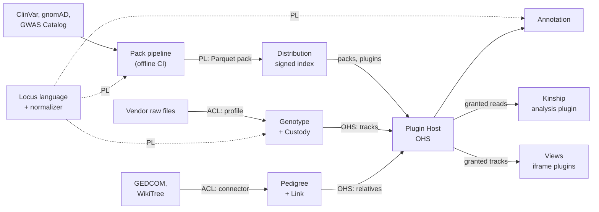

# Decisions: boundaries, stack, integrations, naming

2026-09-19 · @Someone

## Method

Criteria and weights are fixed here, before any option is named, and every decision below is scored against the same set. Rigour scales with reversibility: one-way doors get the full scaffold, two-way doors get a QOC table and a Y-statement.

**Musts** (Kepner-Tregoe screen, pass/fail before scoring)

- M1 Works fully offline after install
- M2 No personal genetic data leaves the device without an explicit, per-plugin user grant
- M3 Every dependency has an OSI-approved licence compatible with an open-source release

**Wants** (swing weights: each weight reflects how much the gap between the best and worst realistic option matters, not the criterion in the abstract)

| Id | Criterion | Weight | Why this weight |
| --- | --- | --- | --- |
| W1 | Correctness of genetic data (normalization, joins) | 25 | Worst-vs-best gap is "silently wrong annotation" vs "right": the product fails on this alone |
| W2 | Privacy by construction | 20 | Musts cover the floor; this scores how much is enforced by structure vs discipline |
| W3 | Plugin-author reach | 15 | Growth path is third-party importers, packs and views |
| W4 | Solo delivery speed to v0.1 | 15 | One developer, weekends; a slow start kills the project |
| W5 | Evolvability (cost to reverse later) | 15 | Scope is large; early boxes must bend |
| W6 | Performance on consumer hardware, incl. phones | 10 | 700k rows is small; the gap between options is modest |

Scores are 1–5 per option per criterion; weighted totals are out of 500. Following Roy, the totals structure the debate; they don't settle it. Each decision names its **sensitivity points** (one attribute moves strongly) and **trade-off points** (two attributes move in opposite directions), per ATAM.

Evidence certainty uses GRADE-style levels: **High** (verified by spike, source or standard), **Moderate** (strong precedent), **Low** (reasoning only).

## D1 Runtime topology (one-way door)

Recommendation: **one shared core compiled to both WASM and native, shipped first as a PWA, with an optional Tauri desktop shell later.** This amends ADR-0002, which was browser-only. All three methods converge on it; they disagree only on how urgent the desktop shell is.

**Frame:** executive decision, one-way door, Cynefin *complicated* (knowable with analysis and spikes).

### QOC matrix

| Option | M1–M3 | W1 Correct 25 | W2 Privacy 20 | W3 Reach 15 | W4 Speed 15 | W5 Evolve 15 | W6 Perf 10 | Total /500 |
| --- | --- | --- | --- | --- | --- | --- | --- | --- |
| T4 PWA + optional Tauri, shared Rust core | Pass | 5 | 5 | 5 | 4 | 5 | 4 | **475** |
| T1 Browser-only PWA (current ADR-0002) | Pass | 4 | 4 | 5 | 5 | 4 | 3 | 420 |
| T2 Tauri desktop only | Pass | 5 | 5 | 3 | 3 | 3 | 4 | 400 |
| T0 Null: CLI + notebooks | Pass | 4 | 5 | 1 | 4 | 2 | 4 | 345 |
| T3 PWA + Elixir server processing kits | **Fail M2** | – | – | – | – | – | – | screened out |

T3 as a *registry-only* server (no genetic data) passes the musts but adds operations cost for something static hosting does in v0.x. It becomes relevant only if a plugin marketplace needs search, ratings or signing (see S6 in the stack section).

- **Trade-off point:** T1 vs T2 on W2 against W3/W4. A web app reloads code from its host on each visit, so "nothing is uploaded" depends on trusting the host; a signed desktop binary doesn't, but fewer people install it.
- **Sensitivity point:** the storage adapter. T4 only scores 5 on W5 if storage sits behind one interface (OPFS in the browser, native files in Tauri).

### ACH: seeking disconfirmation

Hypotheses: **H1** browser-only is enough long-term; **H2** desktop is necessary; **H3** a shared core with two shells is best. Only diagnostic evidence is listed; C = consistent, I = inconsistent, N = neutral.

| Evidence | Certainty | H1 | H2 | H3 |
| --- | --- | --- | --- | --- |
| E1 A web app's code integrity depends on the host at every load | High | I | C | C |
| E2 Target users include people who won't install a desktop binary | Moderate | C | I | C |
| E3 Whole-genome VCFs (tens of GB, 4–5 M variants) exceed practical browser memory | Moderate | I | C | C |
| E4 WASM memory ceilings on iOS Safari may constrain even chip data | Low | I | N | N |
| E5 Rust compiles to both WASM and native with one codebase | High | N | N | C |
| **Inconsistencies** |  | **3** | **1** | **0** |

H3 is least disconfirmed. What would overturn it: a spike showing the shared-core abstraction costs more than it saves, or no demand for WGS files, which would leave H1 good enough.

### GRADE-style evidence to decision

| Dimension | Judgment | Certainty |
| --- | --- | --- |
| Benefits | Reach now; verifiable offline desktop and WGS support later | Moderate |
| Harms / costs | Storage abstraction, two release pipelines once Tauri ships | Moderate |
| Values | Users weigh privacy over convenience (stated premise of the product) | Low, untested |
| Feasibility | DuckDB-WASM + OPFS on Safari is the unknown | Low, needs spike |
| Recommendation | **Conditional for T4**, revisit after the storage spike |  |

**Y-statement:** In the context of a personal genotype studio for privacy-wary users, facing the tension between web reach and code-integrity guarantees, we chose a PWA plus an optional Tauri shell over one shared Rust core, to achieve reach now and a verifiable offline desktop later, accepting a storage abstraction and a second release pipeline.

## Boundary decisions

Five boundaries decide how the contexts talk. The pattern that recurs: **plugins may translate, only the core may normalize.** Correctness (W1) belongs inside the core; reach (W3) belongs at the edges.

### B1 Shared language between Genotype and Annotation

| Option | W1 | W2 | W3 | W4 | W5 | W6 | Total |
| --- | --- | --- | --- | --- | --- | --- | --- |
| c Published language + one reference implementation, exposed as a host service | 5 | 3 | 5 | 3 | 5 | 4 | **420** |
| a Shared kernel as a TypeScript package | 4 | 3 | 2 | 5 | 3 | 3 | 340 |
| d GA4GH VRS as the internal key | 5 | 3 | 3 | 2 | 4 | 2 | 340 |
| b Published spec only, everyone implements | 2 | 3 | 4 | 3 | 4 | 3 | 305 |

- **The language:** locus key `build:chrom:pos:ref:alt`, VCF 4.4 semantics, left-aligned and minimal, plus strand. rsID is a secondary lookup, never the join key: dbSNP merges and retires rsIDs, and 23andMe uses internal `i`-prefixed IDs.
- **The implementation:** one normalization library, compiled to WASM (browser), native (Tauri, CLI) and Python bindings (pack builds). The host exposes it as `normalize()` to every plugin.
- **VRS:** [VRS 2.0](https://www.ga4gh.org/news_item/variation-representation-specification-vrs-v2-0-is-an-approved-ga4gh-product/) is an approved GA4GH standard with computed global identifiers, and a 2.2 ballot [was published this week](https://zenodo.org/records/22800448). Use it as an export mapping, not the internal key: per-variant digests cost too much for 700k rows and raise the bar for plugin authors.
- **Trade-off point:** c vs a on W1 against W4. One implementation in three targets costs setup time, but option b's divergent implementations are exactly how silent wrong joins happen.
- **Certainty:** Moderate.

### B2 Importer anticorruption layer

| Option | W1 | W2 | W3 | W4 | W5 | W6 | Total |
| --- | --- | --- | --- | --- | --- | --- | --- |
| c Declarative format profiles read by the core; code importers only as fallback | 5 | 4 | 4 | 4 | 4 | 5 | **435** |
| b Code plugin parses to raw rows; core normalizes | 5 | 3 | 4 | 4 | 4 | 4 | 405 |
| d Core-owned importers only | 5 | 4 | 1 | 4 | 2 | 5 | 360 |
| a Code plugin parses and normalizes | 2 | 3 | 5 | 4 | 3 | 4 | 330 |

- Consumer chip files are tab-separated text with four or five columns and a comment header. A profile (delimiter, columns, comment prefix, build, strand convention, no-call token) covers them without running any third-party code.
- Formats a profile can't describe (VCF, gVCF) use a code importer that emits `RawCall` rows. Normalization, strand checks and build verification stay in the core either way.
- **Sensitivity point:** the normalization rule set. It is the single place where a bug makes every downstream annotation wrong, so it gets golden-file tests per vendor and chip version.
- **Certainty:** Moderate.

### B3 Open host service for plugins

| Option | W1 | W2 | W3 | W4 | W5 | W6 | Total |
| --- | --- | --- | --- | --- | --- | --- | --- |
| b Typed Track/Region API with scoped grants, returning Arrow | 4 | 5 | 4 | 3 | 5 | 4 | **420** |
| c Typed API, plus SQL for first-party plugins | 4 | 4 | 4 | 4 | 3 | 5 | 395 |
| a Read-only SQL for all plugins | 3 | 1 | 4 | 5 | 1 | 5 | 295 |

- Grants are scoped by kit, region and track kind. A view plugin gets the region on screen; an analysis plugin that needs whole kits gets a consent prompt naming the kits.
- Exposing SQL would make the storage schema a public contract and let any plugin read every genotype. That scores worst on the two criteria hardest to reverse.
- **Certainty:** Moderate.

### B4 Who owns the person–kit link and consent

| Option | W1 | W2 | W3 | W4 | W5 | W6 | Total |
| --- | --- | --- | --- | --- | --- | --- | --- |
| b New Custody context: data subject, custodian, consent, link | 4 | 5 | 3 | 2 | 5 | 3 | **380** |
| a Pedigree owns the link; Genotype owns consent on the kit | 4 | 4 | 3 | 4 | 4 | 3 | 375 |
| c Genotype owns a subject per kit; Pedigree conforms | 4 | 4 | 3 | 5 | 2 | 3 | 360 |

The scores don't separate a and b; this is where MCDA structures the debate rather than settling it. Settle on reversibility instead:

- A kit's **data subject** (whose DNA) and **custodian** (who imported it) differ as soon as a relative's kit is imported. That distinction is real domain language, not overhead.
- **Recommendation:** start with a, but model `Custody` (subject, custodian, consent record) as its own aggregate inside Genotype, and the person–kit `Link` as its own aggregate inside Pedigree. Either can be lifted into a separate context later without a data migration.
- **Falsifier:** if consent rules start depending on pedigree relationships (for example "a parent may consent for a minor"), extract Custody into its own context then.
- **Certainty:** Low.

### B5 Where Kinship lives

| Option | W1 | W2 | W3 | W4 | W5 | W6 | Total |
| --- | --- | --- | --- | --- | --- | --- | --- |
| c First-party plugin on a new `analysis` capability | 4 | 4 | 5 | 3 | 5 | 4 | **415** |
| b Separate first-party context in the core | 4 | 4 | 3 | 4 | 4 | 4 | 385 |
| a Inside Genotype | 4 | 3 | 2 | 5 | 2 | 4 | 335 |

- Building Kinship as a plugin dogfoods the hardest plugin shape: multi-kit reads under consent grants, heavy compute, derived tracks out. If the plugin API can carry Kinship, it can carry ancestry estimation and pharmacogenomics later.
- **Consequence:** ADR-0006 gains a fifth capability, `analysis`.
- **Certainty:** Moderate.

## Stack per component

Each component gets the tool its job needs, scored on the same criteria. The result: **Rust where correctness and multi-target reuse matter, TypeScript at the edges where plugin authors live, Svelte for the shell by a narrow margin, and Elixir only if a live community hub is ever needed.** DuckDB and Python are there on merit, not taste.

| Id | Component (context) | Pick | Runner-up | Deciding reason | Certainty |
| --- | --- | --- | --- | --- | --- |
| S1 | Normalization kernel + chip/VCF parsing (Genotype) | Rust → WASM, native, Python bindings | TypeScript | One implementation for browser, desktop and pack builds (B1); [noodles](https://github.com/zaeleus/noodles) gives spec-compliant VCF 4.3/4.4 | Moderate |
| S2 | Query engine + storage (all) | DuckDB (WASM in browser, native in Tauri) + Parquet | SQLite | Same SQL in both shells; columnar joins; Parquet is also the pack format | Moderate, spike pending |
| S3 | App shell UI (Views host) | Svelte 5 | React | Views run in iframes, so the shell framework doesn't limit the view ecosystem; decided on fluency and bundle size | Low |
| S4 | Plugin runtime (Plugin Host) | JS/TS modules in Workers and sandboxed iframes; WASM allowed inside | WASM components (Extism, component model) | Largest author pool today; Rust authors ship WASM wrapped in a thin JS module | Low |
| S5 | Analysis compute (Kinship plugin) | Rust → WASM in a Worker | TypeScript | Shares Locus types with S1; segment detection over millions of positions is CPU-bound | Moderate |
| S6 | Pack and plugin index (Distribution) | Static signed JSON index on GitHub Releases | Elixir/Phoenix service | Nothing to operate in v0.x; a service is only worth it for search, publisher accounts and review workflows | Moderate |
| S7 | Pack build pipeline (Annotation, offline CI) | Python + DuckDB, calling the S1 normalizer | Rust CLI | Liftover and bioinformatics tooling live in Python; the shared normalizer keeps W1 intact | Moderate |
| S8 | Desktop shell | Tauri 2 | Electron | Rust core runs natively; small signed binaries | Moderate |
| S9 | GEDCOM parsing (Pedigree connector) | TypeScript, e.g. [js-gedcom](https://github.com/atellier2/js-gedcom) | Rust | Not performance-critical; existing library reads 5.x and 7 | Moderate |
| S10 | Genome views | igv.js base; Gosling.js for chromosome painting | JBrowse 2 | Framework-free embed; Gosling adds custom encodings (initial recon) | Moderate |

### S1 Normalization kernel

| Option | W1 | W2 | W3 | W4 | W5 | W6 | Total |
| --- | --- | --- | --- | --- | --- | --- | --- |
| Rust | 5 | 3 | 4 | 3 | 5 | 5 | **415** |
| Go → WASM | 4 | 3 | 3 | 4 | 4 | 3 | 355 |
| TypeScript | 3 | 3 | 5 | 5 | 2 | 3 | 345 |

TypeScript is fastest to start but must be rewritten for the desktop and pack-build targets, which is exactly the divergence B1 rules out.

### S3 App shell

| Option | W1 | W2 | W3 | W4 | W5 | W6 | Total |
| --- | --- | --- | --- | --- | --- | --- | --- |
| Svelte 5 (assuming fluency) | 3 | 3 | 3 | 5 | 4 | 5 | **365** |
| React | 3 | 3 | 5 | 4 | 4 | 3 | 360 |
| SolidJS | 3 | 3 | 2 | 3 | 4 | 5 | 320 |

- **Sensitivity point:** developer fluency (W4). Without it, React edges ahead. The iframe boundary from ADR-0006 is what makes this a two-way door: Gosling, Mol\* and SeqViz are React components, but each runs in its own view iframe regardless of the shell.

### S6 Where Elixir fits

| Option | W1 | W2 | W3 | W4 | W5 | W6 | Total |
| --- | --- | --- | --- | --- | --- | --- | --- |
| Static signed index (v0.x) | 3 | 5 | 3 | 5 | 4 | 3 | **385** |
| Elixir/Phoenix hub (v1+, if needed) | 3 | 4 | 5 | 2 | 4 | 3 | 350 |
| No index, manual install only | 3 | 5 | 1 | 5 | 2 | 3 | 325 |

The core is local-first, so Elixir's strengths (long-lived concurrent connections, fault-tolerant services) have nothing to serve there. They do fit a community hub: publisher accounts, review queues, live pack-build status, search. That hub never touches genetic data, so it passes M2. Build it only when the static index stops being enough.

## Integration catalogue

Twenty-two integrations fit into five plugin shapes; only two of them ever need the network. Licences decide more than technology here: share-alike and non-commercial sources must ship as separate packs so they never bind the core's licence.

### Genotype sources (importers, anticorruption layer)

| Source | Shape | Status and constraints | Ships |
| --- | --- | --- | --- |
| 23andMe raw data (chips v3–v5) | Format profile | Still downloadable: [TTAM Research Institute bought 23andMe's assets in July 2025](https://sodnascan.com/blog/download-23andme-raw-data/) and the service keeps running | v0.1 |
| AncestryDNA raw data | Format profile | Different chip from 23andMe; overlapping but not identical loci | v0.1 |
| MyHeritage, FamilyTreeDNA, Living DNA | Format profiles | Community-contributed profiles; formats not yet checked | v0.2 |
| VCF / gVCF from whole-genome services | Code importer on noodles | Tens of GB; routed to the desktop shell (D1) | v0.3+ |
| openSNP | None | [Shut down and deleted all data on 30 April 2025](https://www.bleepingcomputer.com/news/security/genetic-data-site-opensnp-to-close-and-delete-data-over-privacy-concerns/), citing privacy risks; a signal that local-first is the right call | – |

### Annotation sources (packs, conformist to the published language)

| Source | Content | Licence | Constraint | Ships |
| --- | --- | --- | --- | --- |
| ClinVar | Clinical significance per variant | CC0 ([per GV-Rep's licence survey](https://arxiv.org/pdf/2407.16940)) | None; reference first-party pack | v0.2 |
| dbSNP rsID merge history | rsID remapping for the normalizer | US government work (not re-verified) | Needed so retired rsIDs still resolve | v0.2 |
| GWAS Catalog | Trait associations | CC0 (same survey) | Associations are population-level; UI must say so | v0.3 |
| gnomAD | Population allele frequencies | [CC0, attribution requested, re-identification forbidden](https://github.com/berntpopp/gnomad-link) | Pre-filter to chip loci; some bundled annotations carry stricter terms | v0.3 |
| ClinPGx (PharmGKB + CPIC) | Drug–gene interactions | [CC BY-SA 4.0](https://api.pharmgkb.org/) | Share-alike: separate pack only. Drug guidance is the closest thing to medical advice here; defer until the IVDR question is answered | Later |
| SNPedia | Community SNP wiki | CC BY-NC-SA (not re-verified) | Non-commercial: third-party pack only, never first-party | Third party |

### Pedigree sources (connectors)

| Source | Shape | Status and constraints | Ships |
| --- | --- | --- | --- |
| GEDCOM 7 and 5.5.1 files | File connector, no network | 7.0.18 is the [latest release (Feb 2026)](https://en.wikipedia.org/wiki/GEDCOM), but 5.5.1 is still what most software exports; spec is Apache 2.0 | v0.4 |
| WikiTree | Network connector | [Read-only API](https://github.com/wikitree/wikitree-api); users log in on WikiTree and return with a token; unidentified apps get strict rate limits | v0.5 |
| FamilySearch | Network connector | Free, but production data needs [acceptance into the Solutions program and a compatibility review](https://developers.familysearch.org/main/docs/getting-started) | Later, gated |
| Ancestry trees | GEDCOM export only | No public tree API as far as I know (not verified) | via GEDCOM |

### Reference data (first-party packs the core depends on)

| Data | Why | Constraint |
| --- | --- | --- |
| GRCh37 reference alleles at chip loci | The normalizer checks each call's alleles against the reference to catch strand flips | The full reference is about 3 GB; ship only the alleles at known chip positions |
| Genetic map (cM per position) | Kinship converts segment length in bases to centimorgans | Licence of candidate maps not yet checked |
| VRS export mapping | Interoperability with clinical and research tools (B1) | Export only, not the internal key |

### Views (from the initial recon)

| Library | Role | Ships |
| --- | --- | --- |
| igv.js | Base genome browser | v0.1 |
| Gosling.js | Chromosome painting, custom encodings | v0.3 |
| SeqViz | Sequence detail for a gene or region | Later |
| Mol\* | 3D structure for variants in known proteins | Later |

## Revised context map

The decisions change the map in four ways: the shared kernel becomes a **published language with one reference implementation** (B1), Kinship moves out to an **analysis plugin** (B5), Custody and Link appear as aggregates (B4), and a **Distribution** context appears for the pack and plugin index (S6).

Solid arrows are data flow, upstream to downstream. Dotted arrows are the published language every context conforms to.

| Relationship | Upstream → downstream | Pattern | Contract |
| --- | --- | --- | --- |
| Vendor files → Genotype | U → D | Anticorruption layer | Format profile or code importer emitting `RawCall`; core normalizes (B2) |
| Locus language → all | U → D | Published language + reference implementation | Locus key, allele rules, `normalize()` in WASM, native and Python (B1) |
| Source databases → Pack pipeline | U → D | Anticorruption layer, offline | Source quirks and licences resolved at build time, never in the app |
| Pack pipeline → Annotation | U → D | Published language | Parquet + manifest (source, build, version, licence, SHA-256) |
| Genotype, Annotation, Pedigree → plugins | U → D | Open host service | Typed Track/Region API, scoped grants, Arrow results (B3) |
| Plugin Host → Views | U → D | Conformist | Views accept any track of a kind they support |
| Plugin Host → Kinship | Customer/supplier | Open host service + consent grant | Multi-kit reads under Custody consent; emits segment tracks (B5) |
| GEDCOM, WikiTree → Pedigree | U → D | Anticorruption layer | Connector maps to Person, Family, Relationship; unknown tags round-trip |
| Distribution → Plugin Host | U → D | Published language | Signed JSON index of packs and plugins |
| Genotype ↔ Pedigree | None | Separate ways | They only meet through the Link aggregate and the host; neither reads the other |

## Naming

**Outcome (19 Sep):** the functional name **Genotype Workbench** is adopted as the project name. Kinlocus scored highest below but is rejected: the compound feels forced, and "locus" makes non-specialists think of locusts. The product name stays open. The scoring missed this because N4 only tested pronunciation, not what a word calls to mind for people outside genetics.

### Step 1: functional names per context

Each name says what the context does, in the language its users already use.

| Context | Functional name | Core terms | Why this name |
| --- | --- | --- | --- |
| Published language | **Locus** | Locus key, allele, build, strand | The one concept every other context agrees on |
| Genotype | **Genotype Store** | Kit, Call, No-call, Custody | Stores and normalizes calls; "store" says it holds data and does no interpreting |
| Annotation | **Annotation Library** | Pack, Source, Citation, Licence | Versioned reference material that you look things up in |
| Pedigree | **Pedigree** | Person, Family, Relationship, Link | The standard genealogy term, and GEDCOM's own model |
| Kinship | **Kinship Analysis** | Segment, cM, Relationship estimate | An analysis, not a store; runs as a plugin (B5) |
| Views | **Track Views** | Track, Region, View | Everything shown is a track (ADR-0005) |
| Plugin Host | **Plugin Host** | Manifest, Capability, Grant | Generic; no better name needed |
| Distribution | **Pack Index** | Index, Signature, Release | A signed list of packs and plugins (S6) |

### Step 2: functional name for the whole

What it is: a local tool to store, annotate and view your own genotype data, and link it to relatives and a pedigree. The concrete noun is **workbench** (a place you bring material to and work on it, like a language workbench or a lab bench). **Genotype Workbench** is the honest description. It also works as a README subtitle under whatever product name wins.

### Step 3: product names derived from the context names

Criteria and weights, set before the candidates:

| Id | Criterion | Weight |
| --- | --- | --- |
| N1 | Traces back to the context names (Locus, Genotype, Pedigree, Kinship) | 30 |
| N2 | Free to use: npm package name free (checked 19 Sep 2026); trademarks and domains not yet checked | 20 |
| N3 | Distinctive enough to search for | 20 |
| N4 | Easy to say in English and Dutch | 15 |
| N5 | Doesn't sound clinical or diagnostic (principle 5, IVDR) | 15 |

| Name | Built from | N1 30 | N2 20 | N3 20 | N4 15 | N5 15 | Total /500 |
| --- | --- | --- | --- | --- | --- | --- | --- |
| **Kinlocus** | Kinship + Locus | 5 | 4 | 5 | 4 | 5 | **465** |
| Lociline | Locus + lineage | 5 | 4 | 5 | 2 | 5 | 435 |
| Kinfold | Kin + folded helix | 3 | 4 | 5 | 5 | 5 | 420 |
| Rootstrand | Pedigree roots + strand | 4 | 4 | 4 | 4 | 5 | 415 |
| Plus Strand | The core normalization rule | 4 | 4 | 3 | 4 | 4 | 380 |
| Kinline | Kin + line of descent | 3 | 4 | 3 | 5 | 5 | 380 |
| Stamboom | Dutch for pedigree | 4 | 4 | 3 | 1 | 5 | 350 |
| Allelic | Allele | 3 | 4 | 3 | 4 | 3 | 335 |
| Heirloom | Inheritance | 2 | 1 | 1 | 5 | 5 | 250 |
| Twine | Two strands | 1 | 1 | 1 | 5 | 5 | 220 |

- **Heirloom and Twine drop out:** both npm names are taken, and both words are too common to search for.
- **Kinlocus** carries both halves of the product: "kin" for Pedigree and Kinship, "locus" for the published language at the core. It reads the same in English and Dutch.
- **Sensitivity point:** N2. The npm check is the only availability check so far. A trademark conflict in EU class 9 or 42, or a taken .org or .dev domain, would put Lociline first on score, with Kinfold as the fallback if ease of saying it matters more than its 15% weight suggests.
- **Proposed use:** `superseded; the repo is genotype-workbench until a product name is chosen`.
