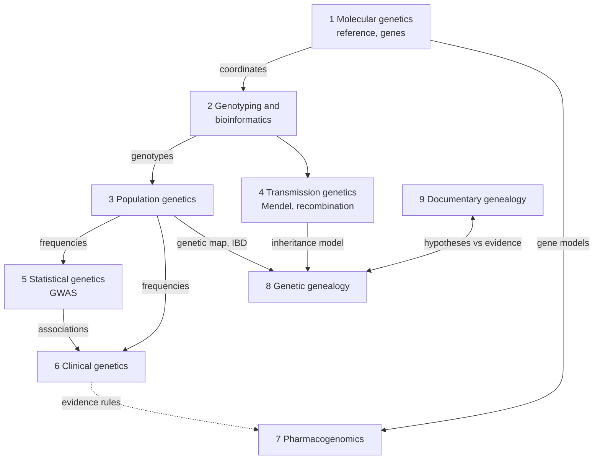

# Scientific domains behind the app

2026-09-19 · @Someone

## Scientific context map

Nine scientific domains sit behind the app, and they share one kernel: **genomic coordinates**. Everything downstream is a different way of asking "what does this position mean?": for a population, for health, for drugs, for relatives. Each domain has its own authorities, its own vocabulary and, above all, its own kind of evidence. That last point matters most for the app.

Solid arrows run upstream to downstream. The dotted arrow is conceptual borrowing: pharmacogenomics grades its evidence the way clinical genetics does, but keeps its own nomenclature. The two genealogies are partners: each tests the other's hypotheses.

| Relationship | Pattern | What crosses the boundary |
| --- | --- | --- |
| Molecular genetics → all | Shared kernel | Reference assembly, chromosome and position, gene and transcript models. Change the build and every downstream fact moves |
| Molecular genetics → Genotyping | Published language | VCF, HGVS nomenclature, dbSNP rsIDs |
| Genotyping → Population genetics | Customer/supplier | Called genotypes; population genetics needs to know chip coverage and error rates |
| Population genetics → Clinical genetics | Customer/supplier | Allele frequencies. A variant that is common in healthy people is unlikely to cause a rare disease |
| Statistical genetics → Clinical genetics | Conformist, loosely | Associations; clinical genetics treats them as weak evidence for individuals |
| Molecular genetics → Pharmacogenomics | Anticorruption layer | Pharmacogenomics translates positions into star alleles (e.g. CYP2C19\*2) through its own allele definitions |
| Transmission + Population genetics → Genetic genealogy | Customer/supplier | Inheritance model, recombination rates (genetic map), background IBD from shared ancestry |
| Genetic ↔ Documentary genealogy | Partnership | Genetics proposes or tests relationships; documents name the people. Neither is complete alone |

## Domain canvases

The column that matters most is **kind of evidence**. It runs from deterministic (a coordinate is right or wrong) through probabilistic (a relationship estimate is a distribution) to curated consensus (a pathogenicity class is a panel's judgment, and it gets revised).

| # | Domain | Question it answers | Core concepts | Authorities and standards | Kind of evidence |
| --- | --- | --- | --- | --- | --- |
| 1 | Molecular genetics | Where is it, and what is there? | Reference assembly, chromosome, position, gene, transcript, exon, codon | Genome Reference Consortium (GRCh37/38), Ensembl, RefSeq, HGVS | Deterministic, but tied to a build version |
| 2 | Genotyping and bioinformatics | What did the test measure? | Probe, call, no-call, strand, allele, rsID, call rate | Chip vendors' manifests, dbSNP, VCF spec | Measurement with an error rate; strand ambiguity for A/T and C/G SNPs |
| 3 | Population genetics | How common is it, and where? | Allele frequency, linkage disequilibrium, haplotype, haplogroup, admixture | gnomAD, 1000 Genomes, PhyloTree (mtDNA), ISOGG (Y-DNA) | Statistical; depends on who was sampled |
| 4 | Transmission genetics | How is it passed on? | Mendelian inheritance, recombination, phase, de novo, mode of inheritance | Textbook science; genetic maps (HapMap-derived and later) | Probabilistic per meiosis, deterministic in constraint (a child can't carry an allele neither parent has, barring mutation or error) |
| 5 | Statistical genetics | What is it associated with? | GWAS hit, effect size, odds ratio, p-value, polygenic score | NHGRI-EBI GWAS Catalog, PGS Catalog | Population-level association, not individual causation; most study participants have European ancestry |
| 6 | Clinical genetics | Does it cause disease? | Pathogenicity class, penetrance, condition, zygosity, carrier status | ClinVar, ClinGen, ACMG/AMP classification guidelines, OMIM | Curated consensus with review levels; classes are revised over time |
| 7 | Pharmacogenomics | How does it change drug response? | Star allele, diplotype, metabolizer phenotype, guideline | PharmVar, CPIC, DPWG, ClinPGx | Curated guidelines; star-allele calling from chip data is often incomplete |
| 8 | Genetic genealogy | How are we related? | IBD segment, centimorgan, shared DNA, relationship prediction, triangulation, endogamy | Community-curated tables of shared cM per relationship; published genetic maps | Probabilistic; ranges overlap between relationships |
| 9 | Documentary genealogy | Who were they, and what happened? | Person, event, source, citation, evidence, conclusion | GEDCOM, Genealogical Proof Standard, archives | Documentary evidence weighed by source quality; conclusions can be revised |

Two boundaries need care because the science is subtle:

- **2 ↔ 3, strand:** for A/T and C/G SNPs, the alleles on one strand are the complements of the other. The strand can't be inferred from the alleles, only from the chip manifest or frequencies. This is where most silent errors in consumer-genomics tools begin.
- **5 ↔ 6, association vs causation:** a GWAS hit says a variant is more common in people with a trait. A ClinVar "pathogenic" says a panel judged it to cause a condition. Showing both in the same style would mislead.

## Same word, different meaning

Nine everyday terms change meaning across domain boundaries. In DDD terms these are the places where one ubiquitous language ends and another begins, and each one needs an explicit translation in the app.

| Term | Meaning by domain | Risk in the app | Proposed app term |
| --- | --- | --- | --- |
| Allele | Genotyping: the letter called on a strand. Molecular: a sequence variant. Pharmacogenomics: a named haplotype (star allele, e.g. CYP2D6\*4) | A single-letter call treated as a star allele, or vice versa | `Call.alleles` for letters; `StarAllele` only inside a PGx plugin |
| Variant | Molecular: any difference from the reference. Clinical: a candidate cause of disease. Consumer: "you have a variant" implies something wrong | Users read every variant as bad news | Show "differs from reference" in neutral language |
| Reference | Molecular: the assembly build. Clinical: often read as "normal" or "healthy" | The reference allele is taken as the healthy one; it is only the one in the assembly | Always pair with build: "GRCh37 reference" |
| Risk | Statistical: odds ratio in a study population. Clinical: absolute lifetime risk given a genotype | A relative odds ratio shown as a personal absolute risk | Avoid in the core; annotation packs state which kind they carry |
| Ancestry | Population: similarity to reference panels. Documentary genealogy: named ancestors | "23% Scandinavian" read as a statement about ancestors | Keep "reference-panel similarity" and "ancestors" as separate concepts |
| Relationship | Genetic genealogy: a probabilistic estimate from shared cM. Documentary: a documented fact (parent of) | An estimate saved into the pedigree as a fact | Pedigree stores relationships with an evidence type (documentary, genetic estimate, both) |
| Segment | Genetic genealogy: an IBD stretch shared by two people. Molecular: any region | Minor, but it confuses track naming | `SharedSegment` in Kinship; `Region` elsewhere |
| Match | Genetic genealogy: another tester sharing DNA. Bioinformatics: a sequence alignment hit | Minor | `DnaMatch` if it's ever needed |
| Significance | Statistical: p-value. Clinical: ClinVar's pathogenicity class, called "clinical significance" | "Significant" read as "clinically important" when it only meant p < 0.05 | Use "classification" for ClinVar, "p-value" for GWAS |

## Mapping onto the app's contexts

The app's contexts cut the science along lifecycle lines (who stores it, who versions it, who may read it), so most app contexts hold several scientific domains, and one domain can spread across several contexts. Transmission genetics is the one domain the app uses but doesn't yet model anywhere explicit.

**P** = primary home of the domain's concepts. **U** = uses the domain's facts. Blank = not involved.

| Scientific domain | Locus language | Genotype Store | Annotation Library | Pedigree | Kinship Analysis | Track Views |
| --- | --- | --- | --- | --- | --- | --- |
| 1 Molecular genetics | P | U | U |  |  | U |
| 2 Genotyping and bioinformatics | U | P |  |  | U |  |
| 3 Population genetics |  |  | P (frequency packs) |  | U | U |
| 4 Transmission genetics |  |  |  | U | U |  |
| 5 Statistical genetics |  |  | P (GWAS pack) |  |  | U |
| 6 Clinical genetics |  |  | P (ClinVar pack) |  |  | U |
| 7 Pharmacogenomics |  |  | P (deferred pack) |  |  |  |
| 8 Genetic genealogy |  |  |  | U | P | U |
| 9 Documentary genealogy |  |  |  | P |  | U |

### What each app context holds, scientifically

| App context | Scientific content | Where the science is hardest |
| --- | --- | --- |
| Locus language | Coordinates and allele representation from molecular genetics | Build versions, indel normalization, strand |
| Genotype Store | Measurements from genotyping: calls, no-calls, chip version | Palindromic SNP strand, vendor-specific IDs, error rates |
| Annotation Library | Four domains (3, 5, 6, 7), each as separate packs | Each pack carries a different kind of evidence; the library must preserve the difference, not flatten it |
| Pedigree | Documentary genealogy, plus relationship claims | Holding relationships from two kinds of evidence |
| Kinship Analysis | Genetic genealogy, built on transmission and population genetics | Chip data is unphased, so segments are half-identical; endogamy inflates shared cM; ranges overlap |
| Track Views | Presents all nine | Keeping the evidence kind visible in the visual encoding |

### Gaps: science in scope that no app context owns yet

| Gap | Science | Natural home | Why it matters |
| --- | --- | --- | --- |
| Mendelian consistency checks | Transmission genetics | A plugin on Kinship's analysis capability | With parent and child kits, impossible genotypes reveal chip errors or wrong pedigree links: a strong data-quality feature |
| Phasing | Transmission genetics | Same | Parent kits let you assign each allele to a parent, which makes segments far more accurate |
| Haplogroups (Y-DNA, mtDNA) | Population genetics | Analysis plugin with a PhyloTree or ISOGG pack | Common consumer interest; a clean, deterministic lookup from chip data |
| Ancestry composition | Population genetics | Analysis plugin with a reference-panel pack | Popular, but needs large reference panels and clear wording (see "Ancestry" above) |
| Polygenic scores | Statistical genetics | Out of scope for now | Personal risk estimates conflict with principle 5 and sit close to the IVDR question |

## What this changes in the design

The boxes stay the same. What the science adds is one missing concept, **evidence kind**, which has to travel with every fact from source to screen.

1. **Add `evidenceKind` to the Track contract (ADR-0005).** Values: `measured`, `statistical-association`, `curated-classification`, `probabilistic-estimate`, `documentary`. Views use it to choose the encoding, so a GWAS association never looks like a ClinVar classification.
2. **Pack manifests declare their scientific domain and evidence kind (ADR-0007).** The Annotation Library already holds four different sciences. The manifest makes that explicit instead of leaving each pack to describe itself.
3. **Pedigree relationships carry provenance.** A relationship is `documented`, `genetically estimated` (with the cM range), or both. Kinship results never write into Pedigree as facts; the user confirms a link and the evidence is recorded.
4. **Palindromic SNPs get a flag in the Genotype Store.** A/T and C/G calls are marked `strand-ambiguous` at import, so annotation joins on them are shown with lower confidence or skipped.
5. **Transmission genetics becomes a named capability.** Mendelian checks and phasing are the first analysis plugins after Kinship. They turn relatives' kits from a privacy cost into a data-quality gain.
6. **Add the nine-term glossary to the published language.** The "proposed app term" column above becomes part of the Locus language docs, so plugin authors use the same words.
